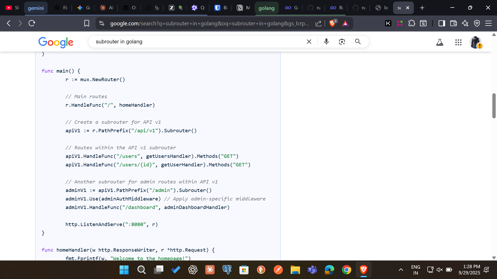

resource: https://gowebexamples.com/

```sh
go run main.go
```

Creates go.mod for dependency management; replace placeholders with your GitHub username/project name

> go.mod will display: `module github.com/rishi/golang-learn`

```sh
go mod init github.com/<yourname>/<yourproject>
```

using gomux:
https://gowebexamples.com/routes-using-gorilla-mux/

